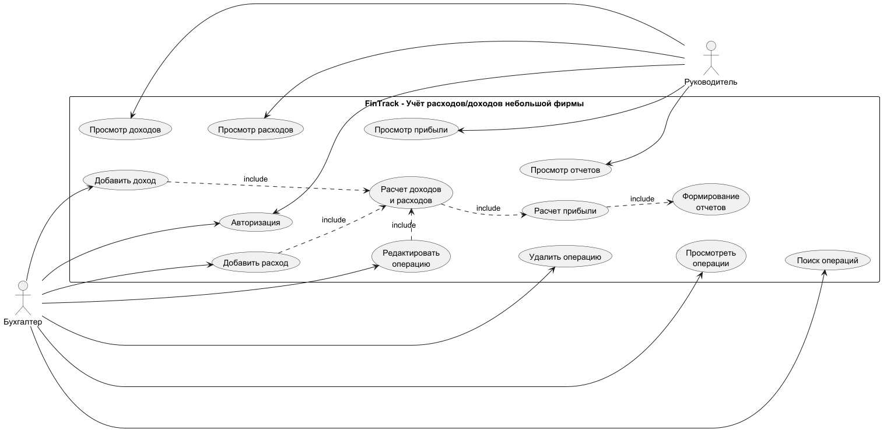

# Учет доходов/расходов небольшой фирмы
## Цель работы
Изучить основные этапы создания информационной системы. Научиться описывать её задачи, пользователей и основные функции. Получить навыки создания  Use Case диаграмм и блок-схем для наглядного представления работы системы.
## Практическая часть
## 1. Постановка задачи
### 1.1 Описание предметной области
Предметной областью проекта является финансовый учет небольшой фирмы. В процессе своей работы фирма получает доходы, а также расходует денежные средства. Для ведения учета финансов фирмы создается информационная система «FinTrack». Система хранит данные о финансовых операциях фирмы. Бухгалтер может добавлять, удалять, изменять и просматривать информацию о финансовых операциях, выполнять поиск операций и формировать финансовую отчетность. Руководитель фирмы использует систему для контроля финансового состояния предприятия: может просматривать информацию об операциях, а также финансовую отчетность.
### 1.2	Цели и задачи системы
1.	**Регистрация доходов фирмы**  
2.	**Регистрация расходов фирмы**  
3.	**Хранение информации о финансовых операциях**  
4.	**Поиск и просмотр операций**  
5.	**Изменение и удаление операций**  
6.	**Расчёт общей суммы доходов**  
7.	**Расчёт общей суммы расходов**  
8.	**Расчёт прибыли фирмы**  
9.	**Формирование финансовых отчётов**  

### 1.3 Пользователи системы (актеры) и их роли

- **Руководитель:** обычный пользователь. Просматривает и ищет финансовые операции, а также финансовые отчеты.
- **Бухгалтер:** главный пользователь. Добавляет, удаляет, изменяет информацию о финансовых операциях, формирует финансовую отчетность.

### 1.4 Основной функционал

-	**Добавление дохода** (ввод полученной суммы, даты и категории поступления)
-	**Добавление расхода** (ввод затраченной суммы, даты, а также категории расхода)
-	**Редактирование доходов/расходов** (изменение данных сохраненной финансовой операции)
-	**Удаление доходов/расходов** (удаление данных об операциях)
-	**Просмотр финансовых операций/отчетов**
-	**Расчет финансовых показателей**
-	**Формирование отчетов**

### 1.5 Архитектура проекта
Для проекта используется трехуровневая архитектура. Система состоит из трех основных уровней:
1.	**Слой интерфейса:** предназначен для взаимодействия пользователя с системой. С помощью него пользователь может просматривать и добавлять операции, просматривать финансовую отчетность и показатели.  
2.	**Слой бизнес-логики:** отвечает за обработку данных и правила работы системы.  
3.	**Слой данных:** отвечает за хранение информации. Хранит информацию о пользователях, финансовых операциях и т.д.  
## 2. Моделирование процессов и взаимодействий 
### 2.1 Use-case диаграмма:
